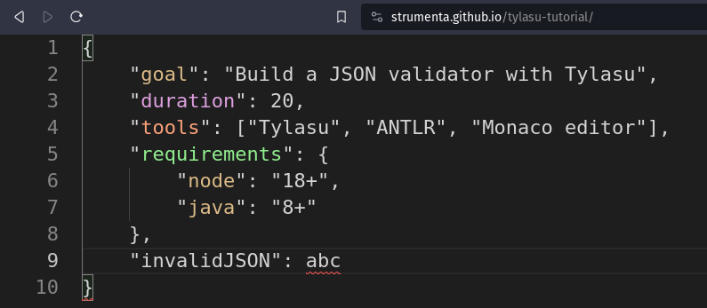

# Tylasu tutorial

This is the companion repository for the [tutorial on Tylasu].

It shows how to use Tylasu, ANTLR and Monaco to build a JSON validator webpage:



You can try it online at https://strumenta.github.io/tylasu-tutorial

## Run it locally

You will need Java 8+ and Node 18+ installed.

```shell
$ npm run all
```
will build the project and serve it on port 3000.

Now visit http://localhost:3000.


[tutorial on Tylasu]: https://tomassetti.me/build-a-rich-json-validator-website-with-tylasu
